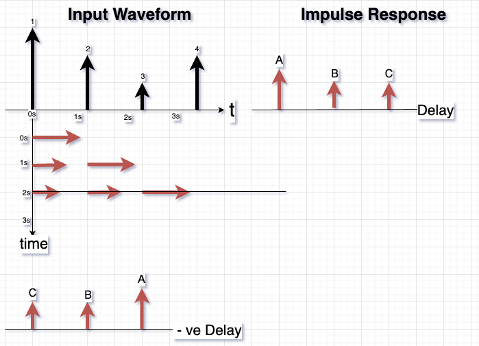

```{r setup, include=FALSE}
library(blogdown)
library(tidyverse)
library(ggformula)
library(mosaicCalc) # Analytic Calculus
library(ambient) # Noise generation in R
library(plot3D) # 3D plots for explanation
library(caracas)
library(gsignal)
library(downloadthis)
library(knitr)
library(kableExtra)
## Markdown boiler plate stuff!!
# {#fig-elephant}
# This is illustrated well by @fig-elephant.
# 
# ### Figure Panel Divs
#     ::: {#fig-elephants layout-ncol=2}
#     {#fig-surus}
#     {#fig-hanno}
#      Famous Elephants
#     :::
#     Adding download buttons
#     data that has been read in
#     
#    existing file
#     

```

```{r}
#| label: Extra Pedagogical Packages
#| echo: false
#| message: false

library(checkdown)
library(epoxy)
library(grateful)
library(MKdescr)
library(shinylive) # To create a Shiny app in a Quarto HTML doc
# Will not work if webr is also used in the SAME Quarto doc!
library(sysfonts)
library(gfonts)
library(kableExtra)
# library(conflicted)
# conflicted::conflicts_prefer(dplyr::filter, dplyr::count, dplyr::last, dplyr::glimpse, base::max)
library(downloadthis)
#devtools::install_github("mccarthy-m-g/embedr")
library(embedr) # Embed multimedia in HTML files
```

```{r}
#| label: Plot Sizing and theming
#| echo: false
#| message: false
#| results: hide

# https://stackoverflow.com/questions/74491138/ggplot-custom-fonts-not-working-in-quarto

# Chunk options
knitr::opts_chunk$set(
 fig.width = 7,
 fig.asp = 0.618, # Golden Ratio
 #out.width = "80%",
 fig.align = "center"
)
### Ggplot Theme
### https://rpubs.com/mclaire19/ggplot2-custom-themes

theme_custom <- function(){ 
    font <- "Roboto Condensed"   #assign font family up front
    
    theme_classic(base_size = 14) %+replace%    #replace elements we want to change
    
    theme(
      panel.grid.minor = element_blank(),    #strip minor gridlines
      text = element_text(family = font),
      #text elements
      plot.title = element_text(             #title
                   family = font,            #set font family
                   #size = 20,               #set font size
                   face = 'bold',            #bold typeface
                   hjust = 0,                #left align
                   #vjust = 2                #raise slightly
                   margin=margin(0,0,10,0)
),               
      
      plot.subtitle = element_text(          #subtitle
                   family = font,            #font family
                   #size = 14,                #font size
                   hjust = 0,
                   margin=margin(2,0,5,0)
),               
      
      plot.caption = element_text(           #caption
                   family = font,            #font family
                   size = 8,                 #font size
                   hjust = 1),               #right align
      
      axis.title = element_text(             #axis titles
                   family = font,            #font family
                   size = 10                 #font size
),
      
      axis.text = element_text(              #axis text
                   family = font,            #axis family
                   size = 8)               #font size
    )
}

# Set graph theme
theme_set(new = theme_custom())
#
```


```{r,echo = FALSE, eval = FALSE, fig.alt="Petr Slováček on Unsplash", fig.align='center'}
knitr::include_graphics("featured.jpg")

```

##  Inspiration

Consider that you live in a high rise apartment complex. Did you hear that ambulance go by? How did the sound of the siren change as the ambulance approached towards your dwelling and then went past it to get lost amidst the surrounding buildings again?

The siren's **emitted** sound is always the **same**. It is the local surroundings and the *geometry of the echoes* that brings the **same** sound to your ears again and again, but in altered/weighted form. The sound from the ambulance goes all around, hits on or other of the buildings, reflects, and comes back to your ears **after a delay** and **weighted** by the *strength* of the echo geometry.

What you hear is the ***overlapping*** of multiple, weighted copies of the sound emitted by the ambulance. As long as you have direct, i.e. non-reflected path from the ambulance to your ears, the echoes are *relatively subdued*. Once the vehicle gets right into your building complex and you lose the direct line-of-sight path, the echoes take over and the sound becomes a very confused mass that is barely recognizable.


#### What is Convolution?

All right, what does this have to do with **convolution**? Let us make some definitions first:

::: callout-important
### Channel
The free-space medium plus the buildings and other things that reflect sound in our environment, are called the "Channel". The channel acts as a conduit between a source (transmitter) and a receiver.
:::

::: callout-important
### Impulse Response of the Channel
The geometry of the echoes that connect transmitter to receiver, including the bounces of the walls, the resulting path-delays, and weighting are together denoted as the **impulse response** of the *channel*. This is what the *channel* would put out at the receiver if the source transmitter were to emit a very-short-duration signal, like the squeak of a mouse. 
:::

::: callout-important
### Impulse
Now, most signals emitted by a source are usually not "squeak-like": the ambulance has a siren that continuously emits the wellknown sound. Such a continuous signal is capable of mathematically decomposed into a series of "squeak-like" signals, which we call ***impulses***.
:::


So finally:

::: callout-important
### What is Convolution?
Each impulse undergoes the same geometry path-delays and path-weightings posed by the *channel impulse response*. This is diagrammatically shown below:

{#fig-convolution}


We see that impulses in the *input waveform* that arrive ***later*** undergo weighting by the ***earliest*** of path-delays and path-weightings. This should give you the intuition, that mathematically, this is like taking a ***weighted average*** but with the sequence of weights ***inverted in time***!!! (This will become more obvious when we speak of the Wedding Lunch Metaphor below!)

If $in(t)$ is the emitted sound waveform, and $f(t)$ is the channel impulse response, we write the output of the channel as:

$$
\Large{out(t) = \int_{-\infty}^{\infty} in(t) * f(t-\tau) *d\tau}
$${#eq-convolution}

Note that we are integrating wrt ***delay*** $\tau$; and $f$ uses negative $\tau$ as its variable. Hence it is hence inverted in time, as shown in the bottom left of the @fig-convolution. 
:::


## A Wedding Lunch Metaphor

Let us develop a better intuition for Convolution.

Consider a ...nice fat South Indian Wedding. Lots of food, music, relatives, gossip, and of course the bride and groom. The main events are of course the Kashi Yatra, the Oonjal, the Tying of the Thaali, followed by Saptapadhi and so on. Let us say there are some 100 guests who are present and that it being a weekday, they wish to bless the couple and get back to work. So they wait for the the Tying of the Thaali, toss the rice into the air in the general direction of the couple, and...off they go to the huge Dining Hall, where the Marriage Feast of a meal awaits them. Since they are the first to enter the Dining Hall, they are referred to as the first **pankti** for the meal. With a large number of invitees, there would be 3-4 panktis before everyone has eaten.

Very well, 100 `Guests` enter the Dining Hall, and are briskly served by the smart serving staff. A South Indian Wedding Feast has many `Courses` and saatvik dishes, starting with paayasam, rice, pulses, ghee, sambhaar, more rice, rasam, veggies, paapad, curd, pickles, and finally dessert, with very many small side dishes in between. Each course is served in sequence, one after the other. The first pankti gets the first serving of each course, then the second pankti, and so on.

Let us say that the Dining Hall has a capacity for 150 people, and that there are 50 seats still vacant. When all the wedding ceremonies are done, some 50 Late Guests now would approach the pandal, bestow gifts on the couple, and THEN head for the Dining Hall. Now these 50 will be seated in the 50 vacant seats, and serving begins for them. 

So after a while the Head Cook appears majestically at the doorway of the Kitchen, to survey the Hall and to determine what the `State of the Meal` is. He (usually a he, people) decides that 100 guests who arrived early are more advanced in their meal, and are nearing the final Curd Rice course, which he should send in next. The Late Comers are yet to be served the Saambhaar course.

Now, here is the interesting part. If we recognize that the Meal has a **sequence** of Courses, then the `Sequence of Courses` and the `Sequence of Guests` are ***mutually inverted***: the EARLY people are eating the LATER course, and the LATER people are eating the EARLY course!!

So here we complete the metaphor: (whew!):

- The (Meal) Course Sequence is our `Impulse Response`
- All Guests are the `Input` Sequence
- The State of the Meal is the `Output` of the System, and is the `Convolution` of the Course Sequence with the Guest Sequence.

To obtain the proper Output, we need to **time-invert the Meal Sequence** so that the State of the Meal is a weighted count/sum/integral of the two.  

Now we are ready for the Code!!


## Convolution in Code

::: {.panel-tabset .nav-pills style="background: whitesmoke;"}

### Using p5.js


### Using R
In R, we can use a terrific package called `gsignal` that allows us to a lot of Signal Processing stuff.

In the following, we will generate a [Butterworth Lowpass filter] that filters out everything that is above 10Hz. We will plot its `Impulse Response` and then give it an iput of a 2.3Hz sinewave + Noise. 

We will then observe the input and the output and compare them. 

```{r}
#| label: fig-conv-using-gsignal
#| layout: [[45,-5, 45], [100]]
#| fig-cap:
#|   - Filter Frequency Response (LPF)
#|   - Filter Impulse Response
#|   - Input and Output
#| code-fold: true
# library(gsignal)
fs = 4096                     # sampling frequency
bf <- butter(n = 5, w = 10/(fs/2), type = "low")  # 10 Hz low-pass filter (10/fs
t <- seq(0, 1, len = fs)            # 1 second sample
x <- sin(2* pi * t * 2.3) + 0.25 * rnorm(length(t))  # 2.3 Hz sinusoid+noise
z <- filter(bf, x)                    # apply filter


# Outputs
btr <- impz(bf, fs = fs)
bfr <- freqz(filt = bf, fs = fs)

## Make Plots
## Frequency Response
plot(bfr$w, 20 * log10(abs(bfr$h)), type = "l", ylim = c(-10, 0),
     xlim = c(0, 50), main = "Frequency Response of 10Hz Lowpass Butterworth Filter", ylab = "Magnitude in dB", xlab = "Frequency")
## Impulse Response
plot(btr$x, type = "l", main = "Impulse Response of 10Hz Lowpass Butterworth Filter", ylab = "Amplitude", xlab = "Samples")
## input and Output
plot(t, x, type = "l", main = "Input Signal: 2.3Hz Sine + Noise", ylab = "Amplitude", xlab = "Time (s)")
lines(t, z, type = "l", 
      main = "Output Signal: Filtered Output", 
      ylab = "Amplitude", xlab = "Time (s)", col = "red")
legend("topright", legend=c('Input', 'Output'),
       col=c('black', 'red'), lty=1)


```


:::


##  Wait, But Why?

- [Perceptrons](../../100-AI/30-MLP/index.qmd) are a standard convolution operation. 
- Convolution is an operation that is crucial to the operation of [Convolutional Neural Networks](../../100-AI/60-Convnet/index.qmd). The early *(spatial) filter layers* in a CNN implement a convolution with impulse responses that learn to look for edges, curves and similar *canonical* pieces in an input image. 
- When we generate guitar-like sounds using the [Karplus-Strong Guitar Algorithm](../../35-Media/99-KarplusStrong/index.qmd), we are using a set of filters (with low-pass/band-pass impulse responses) in the feedback loop of a delay-line primed with random noise. 
- Convolution can be seen as a series of [Vector Dot Products](../../05-Maths/20-Vectors/index.qmd#what-is-the-inner-product) between two vectors sliding past each other. 

##  References
To be Written Up.


::: {#refs style="font-size: 60%;"}
######  R Package Citations

```{r}
#| echo: false
#scan_packages()
cite_packages(
  output = "table",
  out.dir = ".",
  out.format = "html",
  pkgs = c("keras", "tensorflow", "safetensors")
) %>%
  knitr::kable(format = "simple")

```
:::


