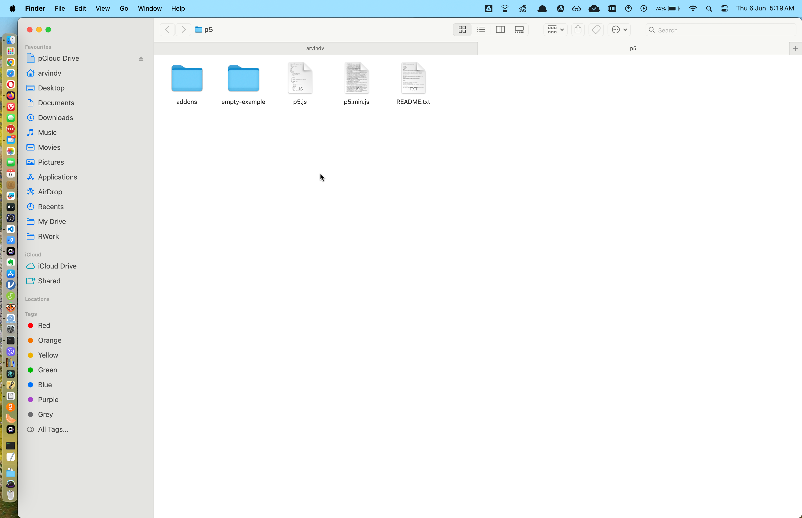

```{r}
#| label: setup
```


## Introduction

We will predomnantly use `p5.js` in this course, since most of use have had some exposure to it and it is of course easy to acquire skill in `p5.js` rapidly. (Some R code may also be demonstrated.)

## The `p5.js` web editor

The best way to use `p5.js` is to use its web editor:

<a>p5js web editor</a>

First play with a few simple commands, and create a few simple shapes and colours to get a feel for our tool. 

Then with our initial fears firmly at bay,let us build our first, and not quite so simple `p5.js` sketch.This will introduce us to many of the settings and constructs inside the tool. This is based on an exercise on [Code Academy](https://www.codecademy.com/courses/learn-p5js-fundamentals/projects/p5js-bouncing-balls). 

<center>
<iframe height=480 width=560 src="https://editor.p5js.org/arvindv/full/57hebuoYs"></iframe>
</center>

And this?

<center>
<iframe height=480 width=560 src="https://editor.p5js.org/arvindv/full/h4ol5X2v3"></iframe>
</center>

Which one was simpler to interpret and modify?


## Wait, But Why?

`p5.js` is very easy for beginners to acquire and see results rapidly. There is also excellent help available on The Coding Train set of video tutorials <u><https://www.youtube.com/@TheCodingTrain></u>, and other web resources.

Using this tool will allow us to focus more energy on the mathematics aspects, and less on the tool itself. 

## Conclusions

- We have gotten our hands dirty with `p5.js`
- Understood the simple configuration of the p5.js Web Editor
- Made a few shapes and colours and perhaps a few animations and mouse-dependent variations also
- Maybe just ready for more action?


## References

1. The Coding Train set of video tutorials <u><https://www.youtube.com/@TheCodingTrain></u>
1. Dan Shiffman. *The Nature of Code* book. <u><https://natureofcode.com></u>
1. CodeAcademy. *p5.js short cheatsheet*. <https://www.codecademy.com/learn/learn-p5js/modules/p5js-introduction-to-creative-coding/cheatsheet>


## Appendices

Although the [p5.js web editor](https://editor.p5js.org) is the simplest way of getting into `p5.js`, there are other ways of using `p5.js`, especially based on the project demands, and on your choice of tool chain and workflow. 


### Installing `p5.js` (if you have to)

One may also install `p5.js`, for situations when one is not online, e.g. for stand-alone projects and public installations that do not have internet access, like a Cat that has swallowed a 8Raspberry Pi that makes cat calls at passersby at the metro, if you want to go that far. We will then also have to install a web-server so that we can see our code outputs locally.



Head off to <https://p5js.org/download/> and download the `Complete Library`. This is a .zip file that you should extract to a folder named `p5` within your `~/Documents` folder.

Your `p5` folder will look like this:

{#fig-p5js-installation}

### Installing Visual Studio Code



Head off to <https://code.visualstudio.com/download> and choose the appropriate file for your OS. 

::: callout-note
#### Mac people

Check whether you have Apple silicon ( M1/M2/M3...) and choose appropriately. The `universal` version of the software also seems worth trying. 
:::

Open VS Code and click on `View` -> `Explorer`. Navigate to your `p5` folder and open it. This will allow you to edit all files there and keep track of other files within this "project" folder. 

#### Installing a local WebServer

When we edit `p5.js` code within VS Code, we will want to see the resultant HTML rendering, since `p5.js` puts out an HTML file everytime. We need to *bind* this output to the browser using a *VSCode Extension* called, [Live Server](https://github.com/processing/p5.js/wiki/Local-server).

  - Open the VS Code extension manager (CTRL-SHIFT-X / CMD-SHIFT-X)
 - Search for and install the Live Server extension.\
 - Add a p5.js project folder to your VS Code Workspace. You have already done this.
 - With your project's index.html ~~or sketch.js~~ file open, start the `Live Server` using the "Go Live" button in the status bar, or by using ALT-L ALT-O.
 - Your sketch should now open in your default browser at location: `127.0.0.1:5500`. Browser window usually pops up.

### Using `p5-manager`

There is a way of creating `p5` project folders, complete with libraries and other files, to create a p5.js project **and** serve it on a local server to view it live as you edit. Very convenient!!

Once you are done, the entire project can be uploaded to a hosting service and voila!

Head off to <https://github.com/chiunhau/p5-manager> and follow the instructions there. Of course you need to use the Terminal, but that should be easy !!

As always, Dan Shiffman has a video on this one:




